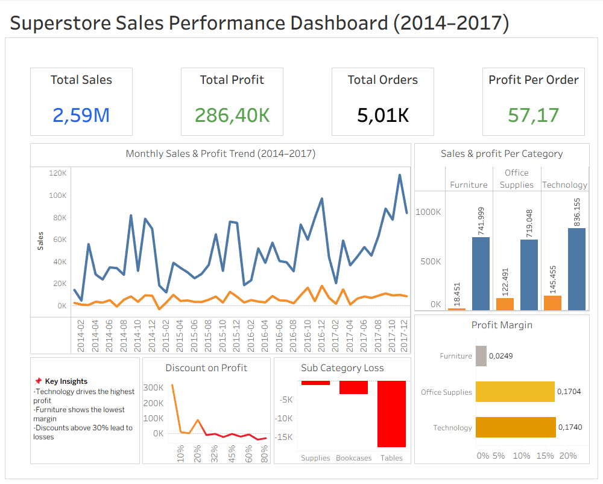

# 🛒 Superstore Sales Performance Dashboard (2014–2017)


End-to-end data analysis project analyzing 4 years of superstore sales data to uncover profitability drivers, discount impact, and category performance using SQL, Excel, and Tableau.

---

## 📊 Live Dashboard

> 🔗 **[View Interactive Dashboard on Tableau Public](#)**
> *(replace this link after publishing to Tableau Public)*

[](https://public.tableau.com)

---

## 📌 Objective

Analyze sales performance and identify key factors affecting profitability across categories, sub-categories, and time periods — with a focus on:

- Category-level profit comparison
- Impact of discount strategy on profit
- Loss-making sub-categories identification
- Monthly and yearly sales trends

---

## 🔄 Workflow

```
Raw CSV  →  PostgreSQL (SQL Analysis)  →  Excel (Aggregated Tables)  →  Tableau (Dashboard)
```

---

## 🛠 Tools & Technologies

| Tool | Purpose |
|------|---------|
| PostgreSQL + DBeaver | Data import, exploration, querying |
| SQL | Aggregation, grouping, trend analysis |
| Microsoft Excel | Data export, intermediate transformation |
| Tableau Desktop | Dashboard design & visualization |
| Tableau Public | Dashboard publishing & sharing |

---

## 📂 Project Structure

```
superstore-sales-analysis/
│
├── data/
│   └── superstore.csv              # Raw dataset (Kaggle)
│
├── sql/
│   └── analysis.sql                # All SQL queries
│
├── dashboard/
│   └── dashboard-porto.twbx        # Tableau Packaged Workbook
│
├── images/
│   └── Dashboard-preview.png       # Dashboard screenshot
│
└── README.md
```

---

## 📊 Dataset

**Source:** Superstore Sales Dataset (Kaggle)

| Field | Description |
|-------|-------------|
| Order ID | Unique transaction identifier |
| Order Date | Date of purchase |
| Category | Product category (Furniture, Office Supplies, Technology) |
| Sub-Category | Granular product type |
| Sales | Revenue per transaction |
| Profit | Net profit per transaction |
| Discount | Discount rate applied |
| Quantity | Units sold |

---

## 📈 Key Metrics

| Metric | Value |
|--------|-------|
| Total Sales | **$2,297,216** |
| Total Profit | **$286,396** |
| Total Orders | **5,009** |
| Profit per Order | **$57.17** |

---

## 📋 Dashboard Features

The Tableau dashboard consists of **9 sheets** organized in **1 dashboard view**:

| Sheet | Chart Type | Insight |
|-------|-----------|---------|
| Total Sales | KPI Card | Overall revenue summary |
| Total Profit | KPI Card | Overall profit summary |
| Total Orders | KPI Card | Transaction volume |
| Profit per Order | KPI Card | Average profit efficiency |
| Monthly Sales & Profit Trend | Dual-line chart | Seasonality & YoY growth |
| Sales & Profit per Category | Grouped bar chart | Category comparison |
| Profit Margin | Horizontal bar chart | Margin efficiency by category |
| Sub-Category Loss | Bar chart | Biggest loss contributors |
| Discount on Profit | Line chart | Discount threshold analysis |

---

## 🔍 Key Insights

### 1. Consistent Growth (2014–2017)
Sales and profit grew year-over-year. Peak performance consistently occurs in **Q4 (November–December)**, suggesting strong seasonal demand that can be leveraged for inventory and marketing planning.

### 2. Category Performance Gap
| Category | Profit Margin |
|----------|--------------|
| Technology | ~17.4% ✅ |
| Office Supplies | ~17.0% ✅ |
| Furniture | ~2.5% ⚠️ |

Furniture significantly underperforms. Despite generating $741K in sales, its net profit contribution is minimal.

### 3. Discount Threshold — The 30% Rule
Profit turns **negative when discounts exceed ~30%**. High-discount transactions are the primary driver of losses, particularly in the Furniture category.

### 4. Loss-Making Sub-Categories
| Sub-Category | Total Loss |
|-------------|-----------|
| Tables | -$17,725 |
| Bookcases | -$3,473 |
| Supplies | -$1,189 |

Tables alone account for the majority of sub-category losses and should be reviewed for pricing or discontinuation.

### 5. Consumer Segment Leads Profit
The Consumer segment contributes the highest profit among all customer segments, making it the primary target for retention and upsell strategies.

---

## 💡 Recommendations

1. **Cap discounts at 30%** — discounts above this threshold consistently produce negative profit
2. **Re-evaluate Furniture pricing** — particularly Tables and Bookcases
3. **Double down on Technology** — highest margin category with strong sales volume
4. **Leverage Q4 seasonality** — optimize inventory and run targeted campaigns in October
5. **Investigate negative-profit months** — identify operational or promotional inefficiencies

---

## 🔎 SQL Analysis Performed

- Total Sales & Profit aggregation
- Monthly Sales & Profit Trends
- Profit by Category and Sub-Category
- Profit Margin calculation
- Loss-making Sub-Category identification
- Discount level vs Profit correlation
- Profit per Order

**Example Query:**
```sql
SELECT
    TO_CHAR("Order Date", 'YYYY-MM') AS month,
    SUM("Sales") AS total_sales,
    SUM("Profit") AS total_profit
FROM superstore
GROUP BY 1
ORDER BY 1;
```

📁 All queries available in [`/sql/analysis.sql`](sql/analysis.sql)

---

## 🧠 Skills Demonstrated

- ✅ SQL querying (aggregation, grouping, date functions)
- ✅ Data import & preparation (CSV → PostgreSQL)
- ✅ Data transformation (SQL → Excel → Tableau)
- ✅ Dashboard design (KPI cards, trend charts, bar charts)
- ✅ Business insight extraction & storytelling
- ✅ Profitability analysis & discount impact analysis

---

## 🚀 How to Open

1. Download `dashboard_porto.twbx` from the `/dashboard` folder
2. Open with **Tableau Desktop** (free trial available)
3. All data is embedded — no external file connection needed

Or view directly on **[Tableau Public](#)** *(link here after publishing)*

---

## 👤 Author

**Billy Ibrahim**
📍 Bandung, Indonesia
🐱 [github.com/billyiad](https://github.com/billyiad)

---

*If you find this project useful, feel free to ⭐ star the repo!*
